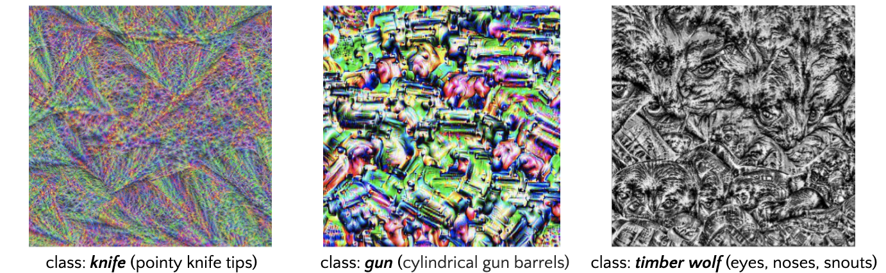

# Decoding Black Box of CNNs using Feature Map Visualizations
Visualizations using individual feature maps of CNN-based image classification models to get insights about their predictions

Ex) Visualizing particular shapes captured by a last layer feature map whose activation is maximized for images belonging to the class, which helps us understand which visual characteristics of each class were learned by the model :

You can find :

* Step-by-step colaboratory notebook [here](https://nbviewer.org/github/lukysummer/Feature-Map-Visualizations/blob/main/Feature_Map_Visaulizations.ipynb)
* My Medium blog post about Feature Map Visualization technique [here](https://medium.com/codex/ch-7-decoding-black-box-of-cnns-using-feature-map-visualizations-45d38d4db1b0)
* `FeatureMapVisualizer` class [here](https://github.com/lukysummer/Feature-Map-Visualizations/blob/main/FeatureMapVisualizer.py)
